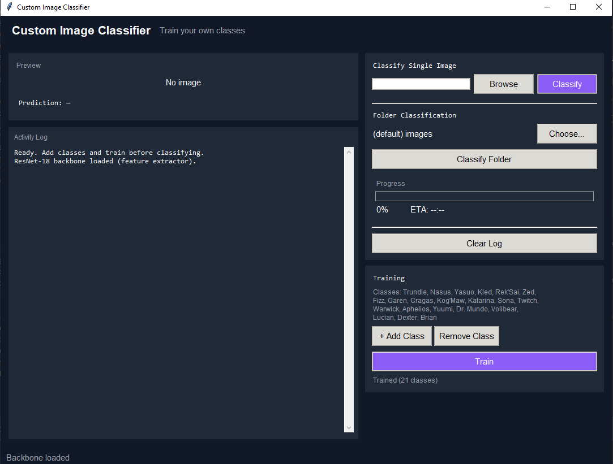

# Custom Image Classifier

A modern AI-powered image classification application built with Python, PyTorch, and Tkinter.

This project uses a pretrained ResNet-18 neural network as a feature extractor and allows users to train their own custom image classes through a clean graphical interface.

---

## 🚀 Features

- Custom image class training
- Single image classification
- Folder batch classification
- Modern dark-themed GUI
- Progress tracking and activity logs
- Real-time image preview
- PyTorch + ResNet-18 backbone
- Supports multiple image formats:
  - JPG
  - JPEG
  - PNG
  - BMP
  - GIF
  - JFIF
  - WEBP

---

## 🖼️ Screenshot

---

## ⚙️ Requirements

- Python 3.10+
- torch
- torchvision
- pillow

Install dependencies:

pip install torch torchvision pillow

---

## 📦 How to Run

python Image_Classifier_Custom_Training.py

---

## 🧠 How It Works

- Uses a pretrained ResNet-18 model from PyTorch
- Extracts image features using transfer learning
- Trains a custom classification head on user-defined classes
- Saves trained model weights locally

---

## 📁 Training Your Own Classes

1. Launch the application
2. Press + Add Class
3. Select images for the class
4. Add at least 2 classes
5. Press Train
6. Start classifying images

---

## 📌 Notes

- More training images generally improve accuracy
- Training is done locally on your machine
- Model weights are automatically saved after training

---

## 🛠️ Technologies Used

- Python
- PyTorch
- Torchvision
- Tkinter
- Pillow

---

## 👨‍💻 Author

Created by Jim
